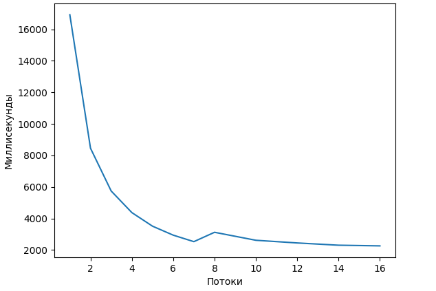

## MPI
|Threads|1|2|3|4|5|6|7|8|10|12|14|16|
|---|---|---|---|---|---|---|---|---|---|---|---|---|
|Ms|16998|8392|5975|4579|3817|3141|2802|4000|3308|2909|2447|2420|

## OpenMP
|x|1|2|3|4|5|6|7|8|10|12|14|16|
|---|---|---|---|---|---|---|---|---|---|---|---|---|
|y|16925|8454|5740|4370|3508|2940|2527|3121|2614|2444|2301|2259|

